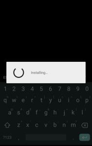
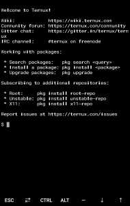

hero: Customising Termux to become more productive!

## Open Termux

* Navigate to the [Termux](./index.md) app on your Android Device.
* Open the app

    ??? help "Excessive Loading?"
        If you are opening the app for the first time then it may take some time
        for it to load all the dependencies required for the app!
        
        

!!! example "The app should look something like this when it loads"
    

## Adding more Keys to the bottom keyboard

You might have noticed that the keyboard at the bottom of the screen has some pretty useful keys by default!
These are `ESC`, `TAB`, `CTRL`, `ALT`, `-`, `DOWN` and `UP`

But you can always edit these if you want to!

For doing that, you first need to create a directory[^1] named `.termux`

??? question "Did you know?"
    On OS X machines, the files which start with `.` are hidden.
    These aren't shown when you type in `ls`. To show these files you have to use the `-a` flag

    !!! example
        ```bash
        $ ls -a
        ..  .  directory  file.txt
        ```


<!-- Footnotes -->
[^1]: In computer language, folders are called directories.